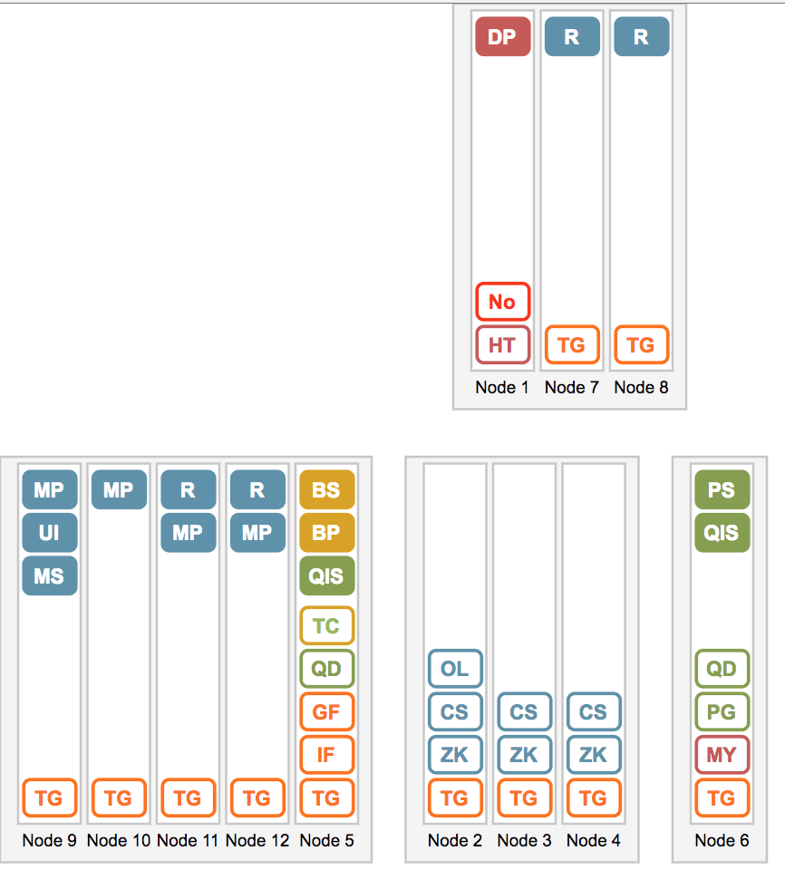
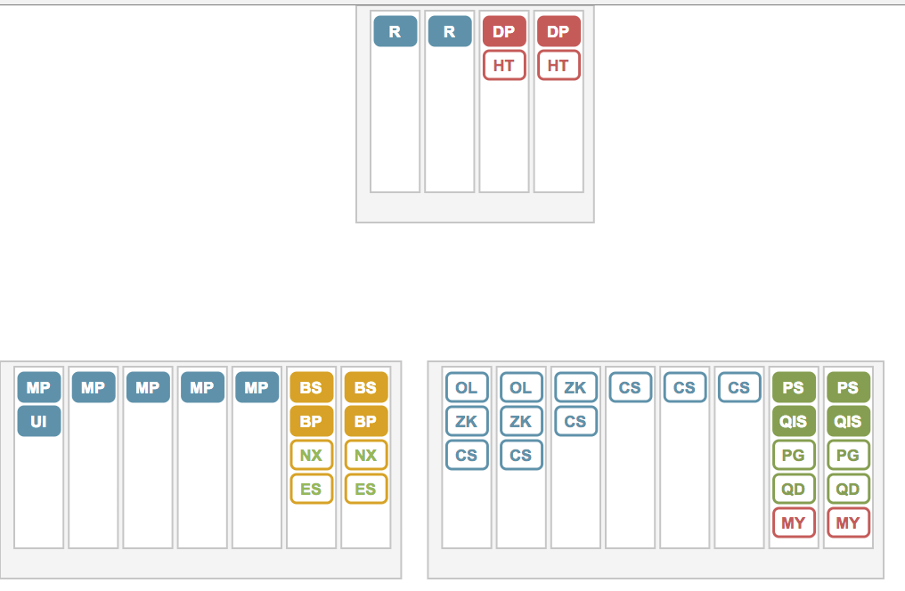

# etp alpha release


# ETP Edge Topology Processor

Utility to generate different artifacts using Edge topology configuration definition.

A configuration is written using JSON format. 

Examples of configurations can be seen in the examples folder.

## Quick Start Guide

1. install utility from github

npm install -g https://github.com/yuriylesyuk/etp/tarball/master


2. Fetch an example topology to your working folder. 

```shell
wget https://raw.githubusercontent.com/yuriylesyuk/etp/master/examples/uat-19n-3sn-topology.json
```
or
```shell
wget https://raw.githubusercontent.com/yuriylesyuk/etp/master/examples/uat-12n-4sn-topology.json
```

3. Generate svg diagram for the topology.
```shell
etp generate diagram $PWD/uat-19n-3sn-topology.json $PWD/svgdiagram-uat-19n.svg
```
4. Open generated svg file in your browser.


5. Generate firewall ports request
```shell
etp generate portrequest $PWD/uat-19n-3sn-topology.json $PWD/portrequest-uat19n.csv
```

6. Open generated portrequest.cvs file in Excel.

## Edge Topology Definition

A topology of an Edge installation is represented as a JSON document, defining collections of nodes, subnets, and layout of the particular planet.

An example for a 12 node topologies is given below.

```json
{
    "planet": "UAT",
    "nodes": [
        { "id": 1, "hostname": "nnnxxxyyy01", "ip": "10.119.3.201" },
        { "id": 2, "hostname": "nnnxxxyyy02", "ip": "10.119.3.202" },
        { "id": 3, "hostname": "nnnxxxyyy03", "ip": "10.119.3.203" },
        { "id": 4, "hostname": "nnnxxxyyy04", "ip": "10.119.3.204" },
        { "id": 5, "hostname": "nnnxxxyyy05", "ip": "10.119.3.205" },
        { "id": 6, "hostname": "nnnxxxyyy06", "ip": "10.119.3.206" },
        { "id": 7, "hostname": "nnnxxxyyy07", "ip": "10.119.3.207" },
        { "id": 8, "hostname": "nnnxxxyyy08", "ip": "10.119.3.208" },
        { "id": 9, "hostname": "nnnxxxyyy09", "ip": "10.119.3.209" },
        { "id": 10, "hostname": "nnnxxxyyy10", "ip": "10.119.3.210" },
        { "id": 11, "hostname": "nnnxxxyyy11", "ip": "10.119.3.211" },
        { "id": 12, "hostname": "nnnxxxyyy12", "ip": "10.119.3.212" }
    ],
    "layout": [
        { "node": 1, "components": [ "DP", "NO", "HT" ] },
        { "node": 2, "components": [ "OL", "ZK", "CS", "TG" ] },
        { "node": 3, "components": [ "ZK", "CS", "TG" ] },
        { "node": 4, "components": [ "ZK", "CS", "TG" ] },
        { "node": 5, "components": [ "QIS", "BS", "BP", "TC", "QD", "TG", "IF", "GF" ] },
        { "node": 6, "components": [ "PS", ] },
        { "node": 7, "components": [ "R", "TG" ] },
        { "node": 8, "components": [ "R", "TG" ] },
        { "node": 9, "components": [ "MP", "UI", "MS", "TG" ] },
        { "node": 10, "components": [ "MP", "TG" ] },
        { "node": 11, "components": [ "R", "MP", "TG" ] },
        { "node": 12, "components": [ "R", "MP", "TG" ] }
    ],
    "subnets": [
        { "name": "external", "dmz": true, "nodes": [ 1, 7, 8 ] },
        { "name": "gateway & baas", "nodes": [ 9, 10, 11, 12, 5 ] },
        { "name": "data storage", "nodes": [ 2, 3, 4 ] },
        { "name": "analytics", "nodes": [ 6 ] }
    ]
}
```

## Firewall Ports Request

The etp generates a typical port request spreadsheet that you can use to submit to your Firewall/Security teams to create firewall rules. The generated file is in .csv format and can easily be opened in Excel or your preferred spreadsheet program.

Example contents can be seen on the following screenshot.


## Topology Diagram

The 'g diagram' command will generate an svg file that depicts Edge's topology.

Diagrams for example u12 and u19 topologies are:

u12:



u19:




## Check Ports functionality

The https://github.com/yuriylesyuk/edge-ops project contains two playbooks, checkports.yml and checkport-tasks.yml, that let you verify if ports on different boxes are open.

They use input configuration file in form: 

openapi-dev-ports.json:
```json
{ 
    "ports": [
        { "c": "10.119.3.233", "s": "10.119.3.236", "p": "9999"},
        { "c": "10.119.3.233", "s": "10.119.3.236", "p": "99"}
    ]
}
```

and generate report in form: 
```json
[
    "10.119.3.233 10.119.3.236:9999: Success",
    "10.119.3.233 10.119.3.236:99 Ncat: Connection refused."
]
```

The etp utility automatically generates check ports input configuration for all firewall ports that it creates request for.

You invoke it using following command line.

TODO: right now the configuration file is hard-coded as openapi-dev-ports.json in a playbook folder, but it also is generated when running 'g portrequest' command under same name. So all it good, but to be changed later.

```shell
ansible-playbook -i "localhost," checkports.yml
```
