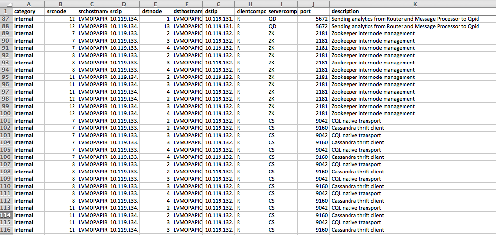
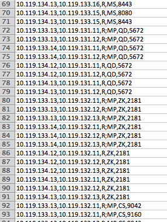
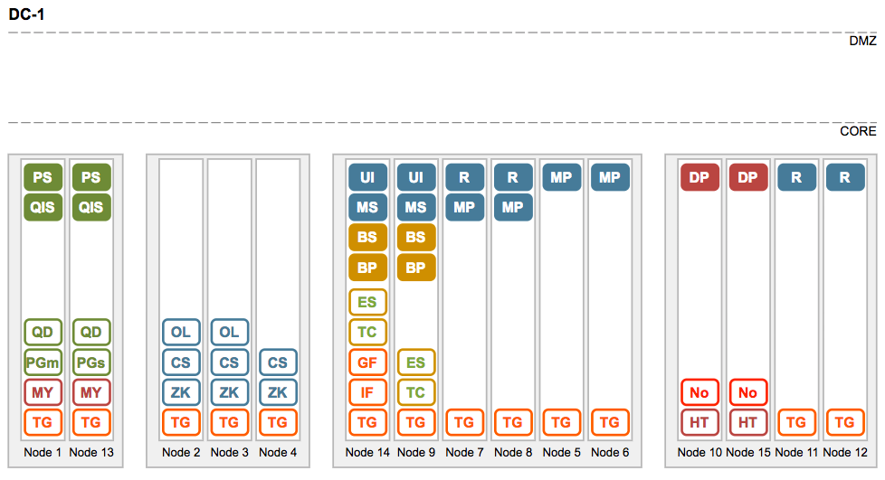
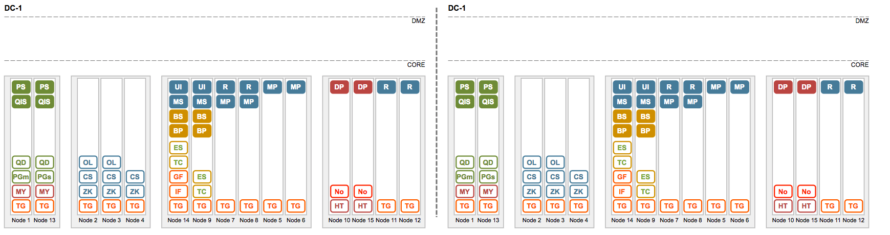
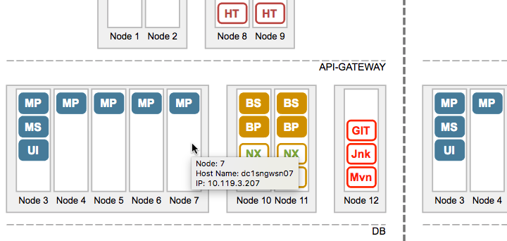
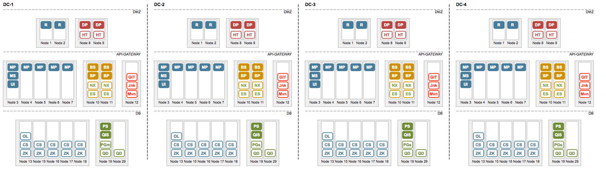
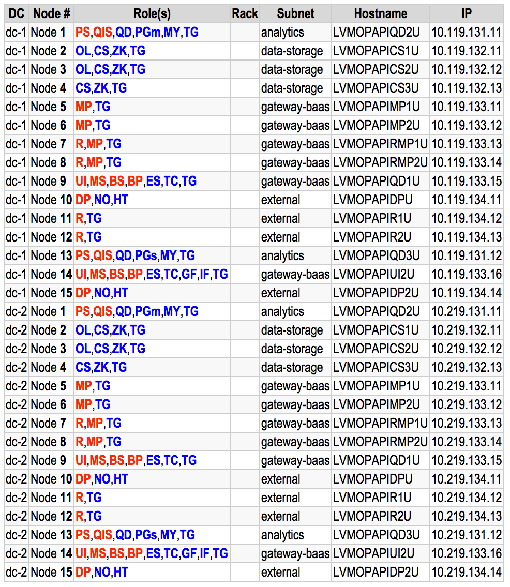

<hr>
# etp closed beta release
<hr>

# ETP Edge Topology Processor

Utility to generate different artifacts using Edge topology configuration definition.

A configuration is written using JSON format. 


## Introduction


The ETP potential target audiences are:
 
* GAs implementing non-trivial topologies;
* SEs/Sales generating POC topology diagrams for inclusion into Slides for  workshops and presentations;
* Partners, implementing Private Cloud installations;
* Customers of Edge Private Cloud edition;
 
We do support true Multi-DC planets. Ie., more than 2.
 
There are more artefacts generated out-of-the-box using input topology definition:
 
* SVG Diagrams;
* Firewall Port requests (with full, compact, and supercompact versions)
* Automated check if all required ports are open (ansible script-based)
* Html nodes Inventory
* Ansible hosts file
* ssh config file
* DC silent install configuration files /per DC [WIP]
* Ansible top-level playbook invocation file/Planet-wide [WIP]
* Scripts to start/stop for the whole planet in a correct order
 
With support of
* Versioning;
* Racks;
* Subnets
* Logical Deployment Tiers
* Port requests with port descriptions (a small feature, but super-important for the customer!)
* External Client ports

## Quick Start Guide

1. Install utility on your local drive directly from github
NOTE: node.js is a prerequisite.

npm install -g https://github.com/yuriylesyuk/etp/tarball/master


2. Fetch an example topology to your working folder. 

```shell
wget https://raw.githubusercontent.com/yuriylesyuk/etp/master/examples/uat-12n-4sn-topology.json
```
or
```shell
wget https://raw.githubusercontent.com/yuriylesyuk/etp/master/examples/prod-2dc-19n-5sn-topology.json
```

3. Generate svg diagram for the topology.
```shell
etp generate diagram $PWD/uat-1dc-15n-4sn-topology.json $PWD/uat-1dc-15n-4sn-diagram.svg
```
4. Open generated svg file in your browser.
```
open -a /Applications/Google\ Chrome.app/ uat-1dc-15n-4sn-diagram.svg
```

5. Generate firewall ports request
```shell
etp generate portrequest $PWD/uat-1dc-15n-4sn-topology.json $PWD/uat-1dc-15n-4sn-portrequest.csv
```

6. Open generated portrequest.cvs file in Excel.

7. Generate Inventory and suppementary files
```
etp generate inventory \
 -u opapiadmin \
 -k ~/.ssh/id_ansible \
 -d uat-1dc-15n-4sn \
 $PWD/uat-1dc-15n-4sn-topology.json $PWD/uat-1dc-15n-4sn-inventory.html
 ```

8. Open inventory.html file in a browser
```
 open -a /Applications/Google\ Chrome.app/ uat-1dc-15n-4sn-inventory.html
```
9. Look for generated ansible hosts, .cfg files, et al.

## Edge Topology Definition

A topology of an Edge installation is represented as a JSON document, defining collections of nodes, subnets, and layout of the particular planet.

An example for a 12 node topologies is given below.

```json
{
    "planet": "UAT",
    "regions": [
        {
            "id": "1",
            "name": "dc-1",
            "subnets": [
                {
                    "name": "external",
                    "tier": "dmz",
                    "nodes": [
                        {
                            "id": 1,
                            "hostname": "nnnxxxyyy01",
                            "ip": "10.119.3.201",
                            "components": [
                                {
                                    "comp": "DP"
                                },
                                {
                                    "comp": "NO"
                                },
                                {
                                    "comp": "HT"
                                }
                        },


...............


                }
            ],
            "tiers": [
                { "name": "dmz" },
                { "name": "core" }
            ]
        }
    ]
}
```

For additional examples, see a collection of topologies in an examples/ folder.

## Firewall Ports Request

The etp generates a typical port request spreadsheet that you can use to submit to your Firewall/Security teams to create firewall rules. The generated file is in .csv format and can easily be opened in Excel or your preferred spreadsheet program.

Example contents can be seen on the following screenshot.



Depending on a use case, you might want a full list of port pairs as your Security Department would want to go through it item
by item, component by component, and so some source-ip, destination-ip, and port tuples will not be unique.

When your Firewall Department goes through the list to configure ports, they would want only non-repeatable combinations. There is an option that lets you generete a compact firewall request. The compnents in such a request will be grouped in comma-separated lists and source and destination groups of components will be separeted by semicolon.





## Topology Diagram

The 'g diagram' command will generate an svg file that depicts Edge's topology.

Sample Diagrams for example u12 and u19 topologies are:

uat-12n:



2 data-centre prod-19n:



Svg diagrams support additional information in a form of tooltips.





Here is an example of a 4 data-centre topology.




## Inventory List

The 'etp generate inventory' command generates a number of useful artifacts which make a documeting of your topology an easy and pleasurable experience. 

For a 2-data-centre topolopy above, the inventory html table would looklike



A set of color coding conventions make the reading of the table easier:

Edge and non-edge components are marked in Apigee-Red and Dark-Blue colours respectively.

The Racka are colour-coded as well.


## Fragments of silent configuration files

Currently, fragments of silent configuration files are generated. 

Examples for a 2 DC topology.

An .cfg file for DC1

_prod-2dc-15n-4sn-dc1.cfg:_
```
# Planet: UAT; Version: . Generated by etp at: Fri May 26 2017 15:50:47 GMT+0100 (BST)

#--------------------------------------------------------------------------
# Datacentre: 1
#--------------------------------------------------------------------------
IPDC1N01=10.119.131.11             # PS, QS, QD, PGm, MY, TG
IPDC1N02=10.119.132.11             # OL, CS, ZK, TG
IPDC1N03=10.119.132.12             # OL, CS, ZK, TG
IPDC1N04=10.119.132.13             # CS, ZK, TG
IPDC1N05=10.119.133.11             # MP, TG
IPDC1N06=10.119.133.12             # MP, TG
IPDC1N07=10.119.133.13             # R, MP, TG
IPDC1N08=10.119.133.14             # R, MP, TG
IPDC1N09=10.119.133.15             # UI, MS, BS, BP, ES, TC, TG
IPDC1N10=10.119.134.11             # DP, NO, HT
IPDC1N11=10.119.134.12             # R, TG
IPDC1N12=10.119.134.13             # R, TG
IPDC1N13=10.119.131.12             # PS, QS, QD, PGs, MY, TG
IPDC1N14=10.119.133.16             # UI, MS, BS, BP, ES, TC, GF, IF, TG
IPDC1N15=10.119.134.14             # DP, NO, HT

#--------------------------------------------------------------------------
# Datacentre: 2
#--------------------------------------------------------------------------
IPDC2N01=10.219.131.11             # PS, QS, QD, PGm, MY, TG
IPDC2N02=10.219.132.11             # OL, CS, ZK, TG
IPDC2N03=10.219.132.12             # OL, CS, ZK, TG
IPDC2N04=10.219.132.13             # CS, ZK, TG
IPDC2N05=10.219.133.11             # MP, TG
IPDC2N06=10.219.133.12             # MP, TG
IPDC2N07=10.219.133.13             # R, MP, TG
IPDC2N08=10.219.133.14             # R, MP, TG
IPDC2N09=10.219.133.15             # UI, MS, BS, BP, ES, TC, TG
IPDC2N10=10.219.134.11             # DP, NO, HT
IPDC2N11=10.219.134.12             # R, TG
IPDC2N12=10.219.134.13             # R, TG
IPDC2N13=10.219.131.12             # PS, QS, QD, PGs, MY, TG
IPDC2N14=10.219.133.16             # UI, MS, BS, BP, ES, TC, GF, IF, TG
IPDC2N15=10.219.134.14             # DP, NO, HT

-------------
ZK_HOSTS="$IPDC1N02 $IPDC1N03 $IPDC1N04 $IPDC2N02,$IPDC2N03,$IPDC2N04:observer"
ZK_CLIENT_HOSTS="$IPDC1N02 $IPDC1N03 $IPDC1N04"
CASS_HOSTS="$IPDC1N02:1,1 $IPDC1N03:1,1 $IPDC1N04:1,1 $IPDC2N02:2,1 $IPDC2N03:2,1 $IPDC2N04:2,1"

```

*prod-2dc-15n-4sn-dc2.cfg:*
```
# Planet: UAT; Version: . Generated by etp at: Fri May 26 2017 15:50:47 GMT+0100 (BST)

#--------------------------------------------------------------------------
# Datacentre: 1
#--------------------------------------------------------------------------
IPDC1N01=10.119.131.11             # PS, QS, QD, PGm, MY, TG
IPDC1N02=10.119.132.11             # OL, CS, ZK, TG
IPDC1N03=10.119.132.12             # OL, CS, ZK, TG
IPDC1N04=10.119.132.13             # CS, ZK, TG
IPDC1N05=10.119.133.11             # MP, TG
IPDC1N06=10.119.133.12             # MP, TG
IPDC1N07=10.119.133.13             # R, MP, TG
IPDC1N08=10.119.133.14             # R, MP, TG
IPDC1N09=10.119.133.15             # UI, MS, BS, BP, ES, TC, TG
IPDC1N10=10.119.134.11             # DP, NO, HT
IPDC1N11=10.119.134.12             # R, TG
IPDC1N12=10.119.134.13             # R, TG
IPDC1N13=10.119.131.12             # PS, QS, QD, PGs, MY, TG
IPDC1N14=10.119.133.16             # UI, MS, BS, BP, ES, TC, GF, IF, TG
IPDC1N15=10.119.134.14             # DP, NO, HT

#--------------------------------------------------------------------------
# Datacentre: 2
#--------------------------------------------------------------------------
IPDC2N01=10.219.131.11             # PS, QS, QD, PGm, MY, TG
IPDC2N02=10.219.132.11             # OL, CS, ZK, TG
IPDC2N03=10.219.132.12             # OL, CS, ZK, TG
IPDC2N04=10.219.132.13             # CS, ZK, TG
IPDC2N05=10.219.133.11             # MP, TG
IPDC2N06=10.219.133.12             # MP, TG
IPDC2N07=10.219.133.13             # R, MP, TG
IPDC2N08=10.219.133.14             # R, MP, TG
IPDC2N09=10.219.133.15             # UI, MS, BS, BP, ES, TC, TG
IPDC2N10=10.219.134.11             # DP, NO, HT
IPDC2N11=10.219.134.12             # R, TG
IPDC2N12=10.219.134.13             # R, TG
IPDC2N13=10.219.131.12             # PS, QS, QD, PGs, MY, TG
IPDC2N14=10.219.133.16             # UI, MS, BS, BP, ES, TC, GF, IF, TG
IPDC2N15=10.219.134.14             # DP, NO, HT

-------------
ZK_HOSTS="$IPDC2N02 $IPDC2N03 $IPDC2N04:observer $IPDC1N02,$IPDC1N03,$IPDC1N04"
ZK_CLIENT_HOSTS="$IPDC2N02 $IPDC2N03 $IPDC2N04"
CASS_HOSTS="$IPDC2N02:2,1 $IPDC2N03:2,1 $IPDC2N04:2,1 $IPDC1N02:1,1 $IPDC1N03:1,1 $IPDC1N04:1,1"
```


## ansible hosts file

Ansible hosts file is generated. Two additional options, -u and -k let you provide specific values for ansible_user and ansible_ssh_private_key_file parameters.

```
etp generate inventory \
 -u opapiadmin \
 -k ~/.ssh/id_ansible \
 -x prod-2dc-15n-4sn- \
 -a prod-2dc-15n-4sn-ansible.sh \
 $PWD/prod-2dc-15n-4sn-topology.json $PWD/prod-2dc-15n-4sn-inventory.html
```


~/ansible/hosts:
```
[edge]
dc1n01 ansible_host=10.119.131.11 ansible_user=opapiadmin ansible_ssh_private_key_file=/Users/yuriylesyuk/.ssh/id_ansible
dc1n02 ansible_host=10.119.132.11 ansible_user=opapiadmin ansible_ssh_private_key_file=/Users/yuriylesyuk/.ssh/id_ansible
dc1n03 ansible_host=10.119.132.12 ansible_user=opapiadmin ansible_ssh_private_key_file=/Users/yuriylesyuk/.ssh/id_ansible
dc1n04 ansible_host=10.119.132.13 ansible_user=opapiadmin ansible_ssh_private_key_file=/Users/yuriylesyuk/.ssh/id_ansible
dc1n05 ansible_host=10.119.133.11 ansible_user=opapiadmin ansible_ssh_private_key_file=/Users/yuriylesyuk/.ssh/id_ansible
dc1n06 ansible_host=10.119.133.12 ansible_user=opapiadmin ansible_ssh_private_key_file=/Users/yuriylesyuk/.ssh/id_ansible
dc1n07 ansible_host=10.119.133.13 ansible_user=opapiadmin ansible_ssh_private_key_file=/Users/yuriylesyuk/.ssh/id_ansible
dc1n08 ansible_host=10.119.133.14 ansible_user=opapiadmin ansible_ssh_private_key_file=/Users/yuriylesyuk/.ssh/id_ansible
dc1n09 ansible_host=10.119.133.15 ansible_user=opapiadmin ansible_ssh_private_key_file=/Users/yuriylesyuk/.ssh/id_ansible
dc1n10 ansible_host=10.119.134.11 ansible_user=opapiadmin ansible_ssh_private_key_file=/Users/yuriylesyuk/.ssh/id_ansible
dc1n11 ansible_host=10.119.134.12 ansible_user=opapiadmin ansible_ssh_private_key_file=/Users/yuriylesyuk/.ssh/id_ansible
dc1n12 ansible_host=10.119.134.13 ansible_user=opapiadmin ansible_ssh_private_key_file=/Users/yuriylesyuk/.ssh/id_ansible
dc1n13 ansible_host=10.119.131.12 ansible_user=opapiadmin ansible_ssh_private_key_file=/Users/yuriylesyuk/.ssh/id_ansible
dc1n14 ansible_host=10.119.133.16 ansible_user=opapiadmin ansible_ssh_private_key_file=/Users/yuriylesyuk/.ssh/id_ansible
dc1n15 ansible_host=10.119.134.14 ansible_user=opapiadmin ansible_ssh_private_key_file=/Users/yuriylesyuk/.ssh/id_ansible
dc2n01 ansible_host=10.219.131.11 ansible_user=opapiadmin ansible_ssh_private_key_file=/Users/yuriylesyuk/.ssh/id_ansible
dc2n02 ansible_host=10.219.132.11 ansible_user=opapiadmin ansible_ssh_private_key_file=/Users/yuriylesyuk/.ssh/id_ansible
dc2n03 ansible_host=10.219.132.12 ansible_user=opapiadmin ansible_ssh_private_key_file=/Users/yuriylesyuk/.ssh/id_ansible
dc2n04 ansible_host=10.219.132.13 ansible_user=opapiadmin ansible_ssh_private_key_file=/Users/yuriylesyuk/.ssh/id_ansible
dc2n05 ansible_host=10.219.133.11 ansible_user=opapiadmin ansible_ssh_private_key_file=/Users/yuriylesyuk/.ssh/id_ansible
dc2n06 ansible_host=10.219.133.12 ansible_user=opapiadmin ansible_ssh_private_key_file=/Users/yuriylesyuk/.ssh/id_ansible
dc2n07 ansible_host=10.219.133.13 ansible_user=opapiadmin ansible_ssh_private_key_file=/Users/yuriylesyuk/.ssh/id_ansible
dc2n08 ansible_host=10.219.133.14 ansible_user=opapiadmin ansible_ssh_private_key_file=/Users/yuriylesyuk/.ssh/id_ansible
dc2n09 ansible_host=10.219.133.15 ansible_user=opapiadmin ansible_ssh_private_key_file=/Users/yuriylesyuk/.ssh/id_ansible
dc2n10 ansible_host=10.219.134.11 ansible_user=opapiadmin ansible_ssh_private_key_file=/Users/yuriylesyuk/.ssh/id_ansible
dc2n11 ansible_host=10.219.134.12 ansible_user=opapiadmin ansible_ssh_private_key_file=/Users/yuriylesyuk/.ssh/id_ansible
dc2n12 ansible_host=10.219.134.13 ansible_user=opapiadmin ansible_ssh_private_key_file=/Users/yuriylesyuk/.ssh/id_ansible
dc2n13 ansible_host=10.219.131.12 ansible_user=opapiadmin ansible_ssh_private_key_file=/Users/yuriylesyuk/.ssh/id_ansible
dc2n14 ansible_host=10.219.133.16 ansible_user=opapiadmin ansible_ssh_private_key_file=/Users/yuriylesyuk/.ssh/id_ansible
dc2n15 ansible_host=10.219.134.14 ansible_user=opapiadmin ansible_ssh_private_key_file=/Users/yuriylesyuk/.ssh/id_ansible
```


## Top-level ansible playbook or bash script

As we already know a lot about topology of our planet, it is just logical now to continue generate useful artifacts. 

Another one that etp can provide is a top-level ansible playbook invocation file. 

Currently there is a number of ansible-based installation automation initiatives at Google. As a part of the Beta the plan is to provide alternative generators for many of them. To illustrate the approach, though, the currently generated file complies with the https://github.com/yuriylesyuk/edge-ops project ansible playbooks.


```
ansible-playbook -l dc1n02 $OPS_HOME/edge-comp-setup.yml -e "COMP=zk CFG=prod-2dc-15n-4sn-dc1.cfg"
ansible-playbook -l dc1n03 $OPS_HOME/edge-comp-setup.yml -e "COMP=zk CFG=prod-2dc-15n-4sn-dc1.cfg"
ansible-playbook -l dc1n04 $OPS_HOME/edge-comp-setup.yml -e "COMP=zk CFG=prod-2dc-15n-4sn-dc1.cfg"

ansible-playbook -l dc1n02 $OPS_HOME/edge-comp-setup.yml -e "COMP=cs CFG=prod-2dc-15n-4sn-dc1.cfg"
ansible-playbook -l dc1n03 $OPS_HOME/edge-comp-setup.yml -e "COMP=cs CFG=prod-2dc-15n-4sn-dc1.cfg"
ansible-playbook -l dc1n04 $OPS_HOME/edge-comp-setup.yml -e "COMP=cs CFG=prod-2dc-15n-4sn-dc1.cfg"

ansible-playbook -l dc1n02 $OPS_HOME/edge-comp-setup.yml -e "COMP=ol CFG=prod-2dc-15n-4sn-dc1.cfg"
ansible-playbook -l dc1n03 $OPS_HOME/edge-comp-setup.yml -e "COMP=ol CFG=prod-2dc-15n-4sn-dc1.cfg"

ansible-playbook -l dc1n09 $OPS_HOME/edge-comp-setup.yml -e "COMP=ms CFG=prod-2dc-15n-4sn-dc1.cfg"
ansible-playbook -l dc1n14 $OPS_HOME/edge-comp-setup.yml -e "COMP=ms CFG=prod-2dc-15n-4sn-dc1.cfg"

ansible-playbook -l dc1n05 $OPS_HOME/edge-comp-setup.yml -e "COMP=mp CFG=prod-2dc-15n-4sn-dc1.cfg"
ansible-playbook -l dc1n06 $OPS_HOME/edge-comp-setup.yml -e "COMP=mp CFG=prod-2dc-15n-4sn-dc1.cfg"
ansible-playbook -l dc1n07 $OPS_HOME/edge-comp-setup.yml -e "COMP=mp CFG=prod-2dc-15n-4sn-dc1.cfg"
ansible-playbook -l dc1n08 $OPS_HOME/edge-comp-setup.yml -e "COMP=mp CFG=prod-2dc-15n-4sn-dc1.cfg"

ansible-playbook -l dc1n07 $OPS_HOME/edge-comp-setup.yml -e "COMP=r CFG=prod-2dc-15n-4sn-dc1.cfg"
ansible-playbook -l dc1n08 $OPS_HOME/edge-comp-setup.yml -e "COMP=r CFG=prod-2dc-15n-4sn-dc1.cfg"
ansible-playbook -l dc1n11 $OPS_HOME/edge-comp-setup.yml -e "COMP=r CFG=prod-2dc-15n-4sn-dc1.cfg"
ansible-playbook -l dc1n12 $OPS_HOME/edge-comp-setup.yml -e "COMP=r CFG=prod-2dc-15n-4sn-dc1.cfg"

ansible-playbook -l dc1n01 $OPS_HOME/edge-comp-setup.yml -e "COMP=ps CFG=prod-2dc-15n-4sn-dc1.cfg"
ansible-playbook -l dc1n13 $OPS_HOME/edge-comp-setup.yml -e "COMP=ps CFG=prod-2dc-15n-4sn-dc1.cfg"

ansible-playbook -l dc1n01 $OPS_HOME/edge-comp-setup.yml -e "COMP=QS CFG=prod-2dc-15n-4sn-dc1.cfg"
ansible-playbook -l dc1n13 $OPS_HOME/edge-comp-setup.yml -e "COMP=QS CFG=prod-2dc-15n-4sn-dc1.cfg"

ansible-playbook -l dc2n02 $OPS_HOME/edge-comp-setup.yml -e "COMP=zk CFG=prod-2dc-15n-4sn-dc2.cfg"
ansible-playbook -l dc2n03 $OPS_HOME/edge-comp-setup.yml -e "COMP=zk CFG=prod-2dc-15n-4sn-dc2.cfg"
ansible-playbook -l dc2n04 $OPS_HOME/edge-comp-setup.yml -e "COMP=zk CFG=prod-2dc-15n-4sn-dc2.cfg"

ansible-playbook -l dc2n02 $OPS_HOME/edge-comp-setup.yml -e "COMP=cs CFG=prod-2dc-15n-4sn-dc2.cfg"
ansible-playbook -l dc2n03 $OPS_HOME/edge-comp-setup.yml -e "COMP=cs CFG=prod-2dc-15n-4sn-dc2.cfg"
ansible-playbook -l dc2n04 $OPS_HOME/edge-comp-setup.yml -e "COMP=cs CFG=prod-2dc-15n-4sn-dc2.cfg"

ansible-playbook -l dc2n02 $OPS_HOME/edge-comp-setup.yml -e "COMP=ol CFG=prod-2dc-15n-4sn-dc2.cfg"
ansible-playbook -l dc2n03 $OPS_HOME/edge-comp-setup.yml -e "COMP=ol CFG=prod-2dc-15n-4sn-dc2.cfg"

ansible-playbook -l dc2n09 $OPS_HOME/edge-comp-setup.yml -e "COMP=ms CFG=prod-2dc-15n-4sn-dc2.cfg"
ansible-playbook -l dc2n14 $OPS_HOME/edge-comp-setup.yml -e "COMP=ms CFG=prod-2dc-15n-4sn-dc2.cfg"

ansible-playbook -l dc2n05 $OPS_HOME/edge-comp-setup.yml -e "COMP=mp CFG=prod-2dc-15n-4sn-dc2.cfg"
ansible-playbook -l dc2n06 $OPS_HOME/edge-comp-setup.yml -e "COMP=mp CFG=prod-2dc-15n-4sn-dc2.cfg"
ansible-playbook -l dc2n07 $OPS_HOME/edge-comp-setup.yml -e "COMP=mp CFG=prod-2dc-15n-4sn-dc2.cfg"
ansible-playbook -l dc2n08 $OPS_HOME/edge-comp-setup.yml -e "COMP=mp CFG=prod-2dc-15n-4sn-dc2.cfg"

ansible-playbook -l dc2n07 $OPS_HOME/edge-comp-setup.yml -e "COMP=r CFG=prod-2dc-15n-4sn-dc2.cfg"
ansible-playbook -l dc2n08 $OPS_HOME/edge-comp-setup.yml -e "COMP=r CFG=prod-2dc-15n-4sn-dc2.cfg"
ansible-playbook -l dc2n11 $OPS_HOME/edge-comp-setup.yml -e "COMP=r CFG=prod-2dc-15n-4sn-dc2.cfg"
ansible-playbook -l dc2n12 $OPS_HOME/edge-comp-setup.yml -e "COMP=r CFG=prod-2dc-15n-4sn-dc2.cfg"

ansible-playbook -l dc2n01 $OPS_HOME/edge-comp-setup.yml -e "COMP=ps CFG=prod-2dc-15n-4sn-dc2.cfg"
ansible-playbook -l dc2n13 $OPS_HOME/edge-comp-setup.yml -e "COMP=ps CFG=prod-2dc-15n-4sn-dc2.cfg"

ansible-playbook -l dc2n01 $OPS_HOME/edge-comp-setup.yml -e "COMP=QS CFG=prod-2dc-15n-4sn-dc2.cfg"
ansible-playbook -l dc2n13 $OPS_HOME/edge-comp-setup.yml -e "COMP=QS CFG=prod-2dc-15n-4sn-dc2.cfg"
```

## Check Ports functionality

The https://github.com/yuriylesyuk/edge-ops project contains two playbooks, checkports.yml and checkport-tasks.yml, that let you verify if ports on different boxes are open.

They use input configuration file in form: 

openapi-dev-ports.json:
```json
{ 
    "ports": [
        { "c": "10.119.3.233", "s": "10.119.3.236", "p": "9999"},
        { "c": "10.119.3.233", "s": "10.119.3.236", "p": "99"}
    ]
}
```

and generate report in form: 
```json
[
    "10.119.3.233 10.119.3.236:9999: Success",
    "10.119.3.233 10.119.3.236:99 Ncat: Connection refused."
]
```

The etp utility automatically generates check ports input configuration for all firewall ports that it creates request for.

You invoke it using following command line.

TODO: right now the configuration file is hard-coded as openapi-dev-ports.json in a playbook folder, but it also is generated when running 'g portrequest' command under same name. Good enought for now, but to be changed later.

```shell
ansible-playbook -i "localhost," checkports.yml
```


## Set up ansible identity on nodes from jumpbox

A number of generated scripts provide additional value when used with a sister project https://github.com/yuriylesyuk/edge-ops.

For this, you would need to setup ssh/ansible passwordless access. 

It is still a good idea to use passwords, though. 

It is a one-off operation. Here is an efficient and secure way to perform it.

```
1. Nominate a jumpbox, ie. a VM (could be one of the Edge Nodes) that is able to ssh to all nodes of the planet in every DC.

2. Generate id_ansible identity
cd ~/.ssh
ssh-keygen -t rsa -b 4096  -f id_ansible

NOTE: Do use password!!

2. Use etp to generate ~/ansible/hosts files for the planet.

3. For each node in the planet do
ssh-copy-id -i ~/.ssh/id_ansible <adminuser>@<node>

4. define ~/.ansible.cfg and reference the nodes file
[defaults]
inventory = ~/ansible/hosts
fork = 50

?. Test the setup. On the jumpbox
ansible edge -m ping

NOTE: For id_ansible with passphrase: at the beginning of each session: 
ssh-agent bash; 
ssh-add <key>
export $OPS_HOME=<path to the ansible folder of edge-ops project>

NOTE: For putty on Windows, use puttygen to convert ssh key to .ppk file and 
use pageant to manage the password for a session.
```


## Team
Yuriy 
Nicola